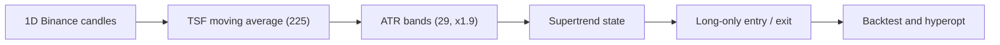
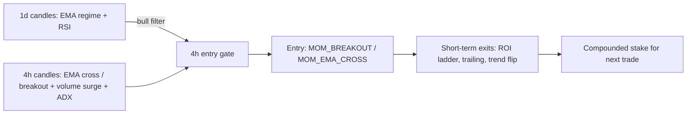

# Kivanc SuperTrended Moving Averages

Lean Freqtrade crypto repo built around a long-horizon spot system that ports Kivanc Ozbilgic's SuperTrended Moving Averages into Freqtrade, plus a short-horizon `4h/1d` momentum strategy (`MomentumVolumeCompound4H`) that compounds realized profit into the next position.

## Snapshot

| Metric | Value |
|---|---:|
| Strategy | `KivancSupertrendedMovingAverages1D` |
| Market | Binance spot |
| Production timeframe | `1d` |
| Research timeframe | `4h` risk validation, `1d` futures long/short |
| Pairs | `BTC ETH BNB SOL XRP` |
| Hyperopt window | `2022-01-01 -> 2026-03-01` |
| Full-period return | `+191.78%` |
| Final balance | `2917.81 USDT` from `1000 USDT` |
| Profit factor | `3.35` |
| Max drawdown | `27.86%` |



## Why This Repo Exists

- One production strategy is easier to validate than a folder full of abandoned experiments.
- The system is intentionally slow and selective: it is designed to catch larger swings, not intraday noise.
- The repo now keeps only the parts needed to download data, backtest, hyperopt, and run the live/paper bot.
- Research now happens through profile-safe scripts that can validate a `4h` risk pack without changing the live `1d` default.

## Production And Research Profiles

- `production_1d`: canonical live/paper profile for the current long-horizon system.
- `risk_validation_4h`: validated research profile that keeps the same entry logic and only changes ROI, stoploss, and trailing behavior on `4h`.
- `futures research`: separate `1d` long/short research path that uses Binance USDT-margined futures without changing the spot production bot.
- `filtered futures research`: the same `1d` futures logic on `BTC ETH BNB XRP`, excluding `SOL` after pair-set validation improved full-period return and drawdown.
- Both profiles live under `freqtrade/user_data/profiles/`.

## Regime Results

| Regime | Profit | Trades | Profit Factor | MaxDD |
|---|---:|---:|---:|---:|
| `bear_2022` | `-14.18%` | 6 | `0.00` | `14.18%` |
| `recovery_2023` | `+55.16%` | 9 | `11.77` | `4.12%` |
| `bull_2024` | `+28.12%` | 8 | `3.87` | `9.79%` |
| `choppy_2025` | `+35.54%` | 8 | `3.14` | `8.18%` |
| `ytd_2026` | `0.00%` | 0 | `0.00` | `0.00%` |

The optimized version is weakest in hard bear conditions and strongest in recovery or trend continuation phases. It behaves like a trend-following allocator, not a high-frequency trader.

## Regime-Aware Validation

- `1d` remains the production decision layer.
- `4h` is used as a research and risk-validation surface, not as the live default.
- Validation is fixed across the same market regimes so profile changes can be compared without moving goalposts.

## New: Momentum Volume Compound 4H

A second, short-horizon strategy now lives alongside the Kivanc system:
`MomentumVolumeCompound4H` (`freqtrade/user_data/strategies_momentum/`).

| Aspect | Design |
|---|---|
| Execution timeframe | `4h` (entries, exits, momentum signals) |
| Regime timeframe | `1d` informative layer (EMA200/EMA50 + daily RSI bull filter) |
| Universe | High-volume pairs via `VolumePairList` (top 12 by quote volume) in dry-run/live; static 8 majors for backtests |
| Entry | EMA(12/36) crossover or 20-bar Donchian breakout, confirmed by a 1.5x volume surge, ADX > 20 and an RSI momentum band |
| Exit | Tiered ROI ladder (6% -> 1% over 48h), -4.5% stoploss, trailing stop after +3.2%, plus trend-flip / RSI-overheat signal exits |
| Compounding | `custom_stake_amount` sizes each entry from the CURRENT total wallet (25% per trade), so realized profit rolls into the next position; a win-streak boost (+15% per consecutive winner, capped at 3) adds size after wins and resets after a loss |



```powershell
# Download 4h + 1d data for the high-volume pair set
.\scripts\download_momentum_4h.ps1

# Backtest the momentum strategy
.\scripts\backtest_momentum_4h.ps1

# Hyperopt buy/sell spaces
.\scripts\hyperopt_momentum_4h.ps1

# Dry-run with dynamic high-volume pair scanning
docker compose run --rm bot1_btceth trade --config user_data/config_momentum_4h.json
```

Note: run the backtest before trusting the defaults. The parameter defaults are
reasonable starting points, not hyperopt-validated values like the Kivanc 1D system.

## Quick Start

```powershell
cd "c:\Users\Emre\Desktop\Buy-sell Algorithm\freqtrade"

# 1) Download or refresh 1D data
.\scripts\download_kivanc_1d.ps1

# 2) Run a full-period backtest
.\scripts\backtest_kivanc_1d.ps1

# 3) Re-run hyperopt if needed
.\scripts\hyperopt_kivanc_1d.ps1

# 4) Download and validate the 4H research profile
.\scripts\download_kivanc_4h.ps1
.\scripts\backtest_kivanc_4h_risk.ps1
.\scripts\compare_kivanc_profiles.ps1

# 5) Download and backtest the 1D futures long/short research variant
.\scripts\download_kivanc_futures_1d.ps1
.\scripts\backtest_kivanc_futures_regimes.ps1

# 5b) Run the filtered 4-pair futures regime matrix
.\scripts\backtest_kivanc_futures_filtered_regimes.ps1

# 6) Hyperopt only the futures risk layer
.\scripts\hyperopt_kivanc_futures_1d_risk.ps1

# 7) Hyperopt the futures entry layer safely
.\scripts\hyperopt_kivanc_futures_1d_buy.ps1

# 8) Compare spot 1D vs futures 1D decision table
.\scripts\compare_kivanc_spot_vs_futures_1d.ps1

# 9) Ask the runtime selector which mode is preferred
.\scripts\select_kivanc_runtime_mode.ps1

# 10) Let the launcher choose the mode and run the matching backtest
.\scripts\run_kivanc_selected_backtest.ps1 -Scenario bull_2024

# 11) Scan futures pair subsets against the current baseline
.\scripts\backtest_kivanc_futures_pairsets.ps1

# 12) Hyperopt only the filtered futures risk layer
.\scripts\hyperopt_kivanc_futures_filtered_1d_risk.ps1

# 13) Hyperopt the filtered futures buy layer safely
.\scripts\hyperopt_kivanc_futures_filtered_1d_buy.ps1

# 14) Start a runtime container from the selector decision
.\scripts\start_kivanc_selected_runtime.ps1 -Scenario full_2022_2026
.\scripts\start_kivanc_selected_runtime.ps1 -Scenario full_2022_2026 -ExposeApi

# 15) Auto-start from the current date, with safe fallback to spot_1d when there is no active regime decision
.\scripts\auto_run_kivanc_selected_runtime.ps1
.\scripts\auto_run_kivanc_selected_runtime.ps1 -ExposeApi

# 16) Stop the dedicated runtime and remove temporary runtime configs
.\scripts\stop_kivanc_selected_runtime.ps1 -ContainerName kivanc_auto_runtime

# 17) Start the default spot bot in dry-run mode
docker compose up -d
```

## Repo Layout

```text
.
|-- README.md
|-- freqtrade/
|   |-- docker-compose.yml
|   |-- README.md
|   |-- reports/
|   |   `-- kivanc_stma_1d_hyperopt_20260308.md
|   |-- scripts/
|   |   |-- backtest_kivanc_1d.ps1
|   |   |-- backtest_kivanc_4h_risk.ps1
|   |   |-- backtest_kivanc_futures_1d.ps1
|   |   |-- backtest_kivanc_futures_filtered_1d.ps1
|   |   |-- backtest_kivanc_futures_filtered_regimes.ps1
|   |   |-- backtest_kivanc_futures_regimes.ps1
|   |   |-- backtest_kivanc_futures_pairsets.ps1
|   |   |-- compare_kivanc_spot_vs_futures_1d.ps1
|   |   |-- compare_kivanc_profiles.ps1
|   |   |-- download_kivanc_1d.ps1
|   |   |-- download_kivanc_4h.ps1
|   |   |-- download_kivanc_futures_1d.ps1
|   |   |-- hyperopt_kivanc_1d.ps1
|   |   |-- hyperopt_kivanc_futures_1d_buy.ps1
|   |   |-- hyperopt_kivanc_futures_filtered_1d_buy.ps1
|   |   |-- hyperopt_kivanc_futures_filtered_1d_risk.ps1
|   |   |-- hyperopt_kivanc_futures_1d_risk.ps1
|   |   |-- hyperopt_kivanc_4h_risk.ps1
|   |   |-- auto_run_kivanc_selected_runtime.ps1
|   |   |-- kivanc_futures_pairset_scan.py
|   |   |-- kivanc_futures_workflow.py
|   |   |-- kivanc_runtime_selector.py
|   |   |-- kivanc_profile_runner.py
|   |   |-- run_kivanc_selected_backtest.ps1
|   |   |-- select_kivanc_runtime_mode.ps1
|   |   |-- stop_kivanc_selected_runtime.ps1
|   |   `-- start_kivanc_selected_runtime.ps1
|   `-- user_data/
|       |-- config.json
|       |-- config_futures_filtered_research.json
|       |-- config_futures_research.json
|       |-- config_production.json
|       |-- data/binance/*.feather
|       |-- profiles/
|       |   |-- production_1d.json
|       |   `-- risk_validation_4h.json
|       |-- strategies_research/
|       |   |-- KivancSupertrendedMovingAveragesFutures1D.py
|       |   `-- KivancSupertrendedMovingAveragesFutures1D.json
|       `-- strategies/
|           |-- KivancSupertrendedMovingAverages1D.py
|           `-- KivancSupertrendedMovingAverages1D.json
`-- tests/
    `-- test_kivanc_strategy.py
```

## Security

- No exchange keys are committed.
- `config.json` and `config_production.json` are safe defaults.
- Research scripts always restore the production strategy JSON after temporary profile application.
- Fill API credentials locally before live trading.
- The auto runtime wrapper is production-safe by default because it falls back to `spot_1d` if the selector currently has no actionable regime.

## Disclaimer

This repository is for research and educational use. Backtests are not forward returns, and crypto market risk remains substantial.
